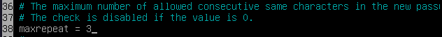

# 42sp_born2beroot
born2beroot made with ❤ for 42sp.

# Tools used

- Oracle VM VirtualBox 6.1.22 r144080 (Qt5.12.8)
- debian-11.1.0

# Key Concepts

## Creating and Managing Partitions


### The `/boot` partition (500MB)

- Reserved 500MB for `/boot` partition (using GRUB bootloader). The recommended size of the `/boot` partition varies from 100MB to 1GB. In distros like [RHEL 7.3](https://access.redhat.com/documentation/en-us/red_hat_enterprise_linux/7/html/7.3_release_notes/bug_fixes_installation_and_booting#idm140052750064672), the default size of `/boot` was increased from 500MB to 1GB, in order to avoid problems in systems with multiple kernels, in which the partition could become full or almost full, preventing upgrades and requiring manual cleanup
- In a LVM environment, the `/boot` partition is usually the only thing outside the LVM, besides frequently is also located in the first sections of the disk thus its resizing cannot be easily done.
- It may be filled with some recovery tools later to act like a rescue partition and a S.O image.

### Extended, Primary and Logical Partitions and the Four Primary Partitions Maximum Limit

- There are three kinds of partition types in the legacy MBR partition scheme: `extended` partitions, `primary` partitions and `logical` partitions.

1. **primary** : It is the most common partitions. A system can contain a maximum of 4 primary partitions and one of them may be a extended partition.
2. **extended** : It is used to contain logical partitions. In systems where you need more than 4 partitions, an extended one is used to hold any number of logical partitions. It cannot be formatted using a file system, such as ext4, FAT or NTFS nor it can hold data directly like the primary or logical drives.
3. **logical** : These are the partitions created inside the extended partition space. The file systems might not be shared within all S.O. For instance, a Windows system might not read a ext2 partition without a third-party driver, but it can natively read a FAT/NTFS logical partition, while Linux can read all of these.

- The practical difference between them is that some systems (mainly Windows) cannot boot from logical partitions, requiring you to install the S.O in a primary partition.
- The `extended` partition's purpose is to extend the four primary partitions limit. By using a extended partition, you can fit many `logical` partitions inside one partition, increasing the initial four maximum threshold.
	```
	MBR: < primary | primary | primary | primary >

	MBR: < primary | primary | extended [logical, logical, logical] >
	```
- The partition identified as `sda2` is the `extended partition` and it contains all the logical partitions created.
- By default, the `lsblk` (List Blocks Devices) command can only deal with "real" partitions, therefore when you use this command, it only shows a dummy 1K partition, because it is not a "real" partition that contains data, but a extended one. To list them properly, you can run as root:

	```
	$ fdisk -l
	// or
	$ parted -l
	// or
	$ blkid -p /dev/sda* | grep sda5
	```

### Logical Volume Management (LVM)

- By definition, LVM is a device mapping framework which manages your logical volumes in the kernel level. The flexibility of LVM allows you to concatenate, combine, resize and move partitions in the disk without the need to unmount.
- When in a limited four partition system, if you run out of space or need to resize partitions, you were required to take the whole system offline, install the new hard drive, boot into a recovery move, create a partition on the new drive and move the data around (with temporary mount points or other tools).
- The use of LVM allows more flexible disk space management, since you can add a collection of multiple phisical hard drives into a single volume group, which you can divide into several logical volumes. Although, the filesystem needs to allow resizing, but with ext2, ext3 and ext4, you can do that both offline (unmounted) and online (mounted).

### Encrypted Partitions with LUKS (Linux Unified Key Setup)

- LUKS is a disk encryption system used by default on Linux that, among other features, stores all the password necessary setup information in the partition header, which allows easier data migration.

### The `/home` partition
- The `/home` partition is optional, but using it might give you some advantages.
- By default, you just store all the files in a root partition `/`, but having a `/home` partition allows you to store your personal files (Documents, Downloads, Pictures and so on). When you don't have a `/home` your files are stored in the `/home/username` folder.
- Also, having a separated `/home` partition helps when you might want to change your distro. You can just backup the partition and carry on to installing the new Linux flavour.

### The `/swap` partition
- There are two basic kinds of memory in a computer:
1. `RAM Memory` (Random Access Memory) which is used to store data and programs while they are actively running. The RAM memory is volatile, meaning that is serves as a temporary storage and when you shut down your computer or close the program, all data saved in RAM is lost. In the hardware level, the data is electrically stored in transistors and when there is no electric current, the data disappears.
2. `ROM Memory` (Read Only Memory) instead of storing data in transistors, the information is stored directly onto the chip, written in individual cells using binary code. Because the data is non-volatile, it is effective to store data like the initial boot-up of the system or other data that cannot be lost on shutdown.
- In this regard, the `/swap` partition's main function is to substitute RAM memory for disk space when needed. The kernel can detect blocks of memory in which the contents have not been used recently and swap these blocks of memory to the `/swap` partition, effectively freeing up RAM. For that reason, in Linux systems, the total amount of memory is the sum of RAM plus swap space. The swap memory is also refered to as `virtual memory`.

- **So... what is the right amount of swap space?**
- Well, for some time, the rule was `swap = 2 * RAM`. So when you have, let's say, 4GB of RAM, you would save 8GB of disk space for the `/swap` partition.
- If you want to use the `hibernation` feature, which saves the current system state into disk, enabling you to power off and restore your PC at startup with the same state you had when you turned it off, you might want to use more space for the `/swap` partition. That extra space allows your system to effectively hold all the RAM data and whatever more you need.
- However, with RAM becoming larger and cheaper, this value has been changing over the years. Here is an example below:

	| System RAM | Recommended swap space | Recommended swap w/ hibernation |
	|------------|------------------------|---------------------------------|
	| < 2GB      | `RAM * 2`              | `RAM * 3`                       |
	| 2GB ~ 8GB  | `= RAM`                | `RAM * 2`                       |
	| 8GB ~ 64GB | `1/2 * RAM`            | `3/2 * RAM`                     |

## Mandatory Access Control (MAC)

### What is MAC?

- `Mandatory Access Control` (MAC) is a type of `access control` used by OS and DBs that aims to control and limit a subject's or initiator access to a resource or operation. In the case of OS it usually means restricting the access to a process or thread to perform an operation in a given object (i.e: files in Unix). In MAC, the security policy is centralized in a administrator, meaning that users to not have the ability to override that policy, granting access to a resource, for example.

### What is DAC?

- In contrast to MAC, we have the `Discretionary Access Control` (DAC) which also controls the ability of users to access certain resources, but allows users to make policy decisions and/or assign security attributes. The Unix system of users/groups and r/w/e permissions is an example of DAC.

### DAC x MAC

- For more info on MAC/DAC, check [MAC vs DAC](https://www.ekransystem.com/en/blog/mac-vs-dac)

### AppArmor x SELinux

- Both AppArmor and SELinux refer to MAC implementations, but their mechanisms and implementation greatly difer.

- AppArmor is more path-based, meaning that it identifies the objects by path. Insecure or untrusted processes run in a restricted confinement that may or may not be allowed to communicate with other processes.

- Security-Enhanced Linux (SELinux) uses inode, or index node in which each inode stores the attributes and disk block locations of the objects's data in a label-like format. It might also include metadata about the objects, like access info, modification, owner and permission.

- In practice, there is a traditional difference between them: in AppArmor, a unaccessible file may become accessible via hard link, since it works with the file paths. In SELinux, the access would be denied because the inode would be different.

## Understanding and using SSH

- SSH stands for Secure Shell or Secure Socket Shell. It is a network protocol that enables a secure access to a computer over an unsecured network. It also refers to a set of utilities that implement the named protocol, like `strong password policies`, `public key authentication` and `encrypted data transfer` between two computers over networks. Two types of encryption are used in the SSH protocol: the `symmetric shared secret` and the `asymmetric public-private keys`.
- Usually, the SSH protocol connects a client to a server in a data-exchanging relation. These actions are carried out in a `assymetric encryption` manner, meaning that the server encrypts messages to the client using the `public key`, whilst the client uses the `private key` to decrypt the message and prove their identity. This procedure is carried out as follows:

1. Client sends an ID for the key/pair it wants to authenticate within the server.

2. The server checks the `~/.ssh/authorized_keys` file of the account which the clients is attempting to log in for the provided ID.

3. If that public key with the matching provided ID is found, the server generates a random number and uses the public key to encrypt the number.

4. The server responds to the client with the encrypted message.

5. The client decrypts the packets with it's associated private key, revealing the encrypted number sent by the server.

6. The client combines the decrypted number with the shared session key that was used to encrypt the packet and calculates the MD5 hash of the value. This hash is then sent back to the server as an answer to the encrypted number packet.

7. The server, using the same shared session key and having the original number, calculates the MD5 hash again and compares his own result with the one that the client sent back.

8. If both values match, it is proven that the client had the private key, and the server authenticates the client connection.


### Changing default SSH port

- First, check the current SSH service status with
	```
	$ sudo systemctl status ssh
	```
	As you will see, the default port for the SSH service is 22.
	

- Then, use

	```
	$ sudo vi /etc/ssh/sshd_config
	```

	to edit the SSH config file, uncomment and change the `Port` line with the 	port you want to use, in our case the 4242 port, then save your changes in 	the file.

	

### Denying Root Login

- To deny SSH login as root we uncomment the following line and set from `yes` to `no`.

	

- To restart the SSH service and apply your changes, use :
	```
	$ sudo service sshd restart
	$ sudo service ssh restart
	```
- To check if the changes you made have been applied, use the command below.
	```
	$ sudo systemctl status ssh
	```
	
- As you can see, we changed the service running port to 4242.

## Package Managers

### What is a package?

- A package is a piece of software you install on your operating system. Whilst we have many kinds of packages, the most common ones are graphical (GUI) applications, command line (CLI) tools and libraries or dependencies required for building another application.

- In older days, we were required to build software from source, that means we usually had a README file with its instructions, dependencies, location of binary files and more. Usually, we could have a configure script or Makefile used to compile and handle the dependencies in a more automated way.

### What is a package manager?

- To abstract that complexity away, Linux distros created their own packaging methods to handle those steps and provide the end user with precompiled binary files, some metadada and a much more friendly installation process. In that instance, in order to install, remove, upgrade, configure and manage software in your operating system you can do it manually, which would take a lot of time and you probably would lose track of most of your programs, or you can use a piece of software to do that for you. In that instance, that's what a package manager does for you: it installs, removes, upgrades, configures and manages software in your operating system.

	

### Kinds of Package Managers

- In Ubuntu/Debian based systems, the most common package managers are `apt`, `aptitude` and `synaptic`. Although they all do the same job, there are differences between how they work, handle packages and present themselves. We will not go deep into the minor differences between those besides offering a very quick explanation about them:
1. `apt` is a more low-level CLI package manager which only works by typing commands such as `apt install` or `apt update`.
2. `aptitude` is a more high-level tool and provides a terminal menu interface where you can navigate instead of typing.
3. `synaptic` is also a more high-level tool and provides a GUI where you can navigate, click and handle your applications in a more graphical way.

## Installing and Configuring the `ufw` firewall

- The UFW Firewall (Uncomplicated Firewall) is a front-end that runs `iptables`. To install it we can run:

	```
	$ sudo apt-get install ufw
	// or
	$ sudo aptitude install ufw
	```
- To check the current status, disable or enable the ufw firewall we can run:

	```
	$ sudo ufw status
	$ sudo ufw disable
	$ sudo ufw enable
	```

### Setting up the defaults

- Some of the most interesting features of using UFW are the defaults for `allowing` or `denying` incoming or outgoing connections. While the need for denying outgoing connections might be a bit too restrictive, it might be necessary in some cases. We can do that with:

	```
	$ sudo ufw default deny incoming
	// and
	$$ sudo ufw default deny outgoing
	```
- There are some features like the default for SSH connections:

	```
	$sudo ufw allow ssh
	```
- Which is the same as:
	```
	$ sudo ufw allow 22/tcp
	```
- But in our case, since our SSH service is running on port 4242, we should use:
	```
	$ sudo ufw allow 4242/tcp
	```
- If we want to enable/disable a range of ports, we can use:
	```
	// Syntax
	$ sudo ufw allow [from]:[to]/[protocol]
	$ sudo ufw deny [from]:[to]/[protocol]
	// Example
	$ sudo ufw allow 1000:2000/udp
	$ sudo ufw deny 1000:2000/udp
	```
- To enable/disable access from specific IP address, we can do:
	```
	// Syntax
	$ sudo ufw allow from [ip]
	$ sudo ufw deny from [ip]
	// Example
	$ sudo ufw allow from 192.168.10.1
	$ sudo ufw deny from 192.168.10.1
	```
- When the rules become numerous and complex, we can check and handle them by a ID number with:
	```
	// To show all rules and their IDs
	$ sudo ufw status numbered
	// Then handle the rule by ID
	$ sudo ufw delete [ID]
	```
- If for whatever reason, we need to reset all the configurations to default values, we can do with:
	```
	$ sudo ufw reset
	```

## User groups and the `root` user

### What is a `group`?

- In Linux systems, a `group` is an array of users that share the same set of privileges for `read`, `write` and `execute` resources inside the system. There are two kinds of groups:

1. `Primary/Login Group` - This is the group that is needed to create file associations to the user who creates it. It usually has the same name as the user who belongs to it. Each user has to belong to **one and only one** primary group. They are listed in the `~/etc/passwd` file.
2. `Secondary/Supplementary Group` - Is used to contain a certain set of privileges which are granted to the belonging users. In this case, a given user can belong to **zero or more** secondary groups. They are listed in the `~/etc/group` file.

	
	- The `akira` group is an example of a `primary group` while the `sudo` group is an example of a `secondary group`. To check a specific user's groups we can type:
		```
		$ groups username
		```

### Creating the `user42` group and adding our user

- To create a user, we user the command `useradd` followed by the name of the user:

	```
	// Syntax
	$ sudo useradd username
	// To create a user with a home directory
	$ sudo useradd -m username
	// Then we set the user's password
	$ sudo passwd username
	```

- To create a group, we use the command `groupadd` followed by the name of the group:

	```
	$ sudo groupadd user42
	```

- Then we want to add user to it using the `usermod -a -G [groupname] [user]`. The `-a` option tells the `usermod` command that we are appending the user to the supplied groups without removing it from other groups and the `-G` option tells that we are appending to the group name that follows the option:

	```
	$ sudo usermod -a -G user42 akira
	// Can be also done concatenating the options
	$ sudo usermod -aG user42 akira
	```

### What is `root`?

- The root user is the superuser account on the system. It has all the privileges and permits. That means it can `read`, `write` and `execute` anything on the system.
- To change the shell mode to root (or superuser) mode, we can run

	```
	$ su
	// or
	$ sudo su
	```
- During the installation, we are prompted for a root password. If we don't supply any or we want to change it, we can run:

	```
	$ sudo passwd root
	// or
	$ su
	# passwd root
	```

### `sudo` in the root context

- In the system administration context, we have a tool called `sudo` which acts as a temporary root permit for any user who belongs to the `sudo group`. It just doesn't just run commands "as if you were root", but literally runs the comand as root.
- If it is not installed it we can run the following command to install it:

	```
	$ apt install sudo -y
	```

## Configuring password policies
- To configure our password policies, we will need to look at the following files:

1. `~/etc/login.defs`
2. `~/etc/pam.d/common-password`

- All the passwords need, in order, to comply to the following rules:

1. Expire every 30 days.
2. Minimum of 2 days days before modification.
3. The user has to receive a message 7 days before their password expires.
4. At least 10 characters long. Must contain an uppercase letter and a number and cannot contain more than 3 consecutive identical characters.
5. Must not include the name of the user.
6. The users password must have at least 7 characters that are not part of the former password.
7. The root password must comply with all these, except number 6.

- Firstly, for the first three rules, we are going to edit the following lines in the`~/etc/login.defs` file as following:

	

- Then, additionally, we want to force the users to use a different password every time it expires, up to the last three passwords used. To do that we are going to append `remember=3` to the `~/etc/pam.d/common-password` file:

	

- For the next policies, we are going to need an additional package to manager the password quality. To install it, run:

	```
	$ sudo apt install libpam-pwquality
	```

- Next, we are editing the password quality configuration file for the package we just installed, which is located at `~/etc/security/pwquality.conf`

- To set the password minimum length, uncomment and edit:

	

- To ensure that it contains at least one uppercase letter and one digit, uncomment and edit:

	

- Then, we make sure that it has at least 2 different classes of characters (one for a uppercase and one for a digit):

	

- To force the use of no more than 3 consecutive characters, uncomment and edit:

	

- For it to not include the user name, uncomment and edit:

	

- Now, we ensure that the new password does not contain less than 7 characters that are different of the former password:

	

## Configuring `sudo`

- Next up, we need to configure our policies for the `sudo group`, which follows the requirements below:

1. Limit auth using `sudo` to 3 maximum attempts.
2. Set a custom message when the supplied password is incorrect.
3. Archive all actions (inputs and outputs) using sudo in the `~/var/log/sudo` folder.
4. Enable `TTY` mode. `TTY` stands for `Teletype Mode`, which prints the file name of the terminal connected to the stdin, or if no file is printed it means that the command is part of a script or is being piped to another output. It is useful to check if the output medium is the terminal.
5. Restrict the paths that can be used by sudo, for example:

	```
	/usr/local/sbin:/usr/local/bin:/usr/sbin:/usr/bin:/sbin:/bin:/snap/bin
	```

- To change these behaviours, we need to edit the sudoers file, located in `~/etc/sudoers` with the following lines:

	

- Remember that since we changed the default path for the logfile, we need to create the directory `~/var/log/sudo` as well as the logfile at `~/var/log/sudo/sudo.log`.

## Creating a system monitoring script

- Now, we are required to create a bash script called `monitoring.sh` that will broadcast some informations in all terminals every 10 minutes. The script must display the following information:

1. The architecture of the OS and the kernel version.
2. The number of physical processors.
3. The number of virtual processors.
4. The current available RAM and the percentage utilization rate.
5. The current available memory (disk) and the percentage utilization rate.
6. The current percentage utilization rate of the processor.
7. The date and time of the last reboot.
8. Whether LVM is active or not.
9. The number of active connections.
10. The IPv4 address of the server and its MAC Address.
11. The number of commands executed with `sudo`.

- The monitoring script is located [here](monitoring.sh). Inside the VM, it is located at `/usr/local/sbin` by convention.

- To schedule and run a job, we need `cron` and to broadcast to all users we use `wall`. As far as I remember, `cron` and `wall` are already installed in Debian by default. To use `cron`, type:
	```
	// Checking scheduled jobs.
	$ crontab -l
	// Edit scheduled jobs.
	$ crontab -e
	```
- `cron` can be used as a regular user or as root. To use root mode, just use sudo or run it as root.
- To use `wall` we can use it normally or pipe another command to it:

	```
	// Regular usage
	$ wall "Hello, users!"
	// To pipe it
	$ echo "Message" | wall
	// To omit the banner
	# echo "Message" | wall -n
	```

- When we edit the jobs, we can also insert a job in the file that opens. The syntax is as follows:
	```
	*/10 * * * * /usr/bin/bash /usr/local/sbin/monitoring.sh | wall -n
	```
- In order, it means:

1. `*/10` - At every 10 minutes
2. `* * * *` - Every hour/day of month/month/day of the week.
3. `/usr/bin/bash` - The full path for bash, since we want bash to run it
4. `/usr/local/sbin/monitoring.sh` - Our monitoring script's location with full path.
5. `| wall -n` - We pipe the output of our script to `wall` to broadcast it, using the `-n` flag to supress the banner.
